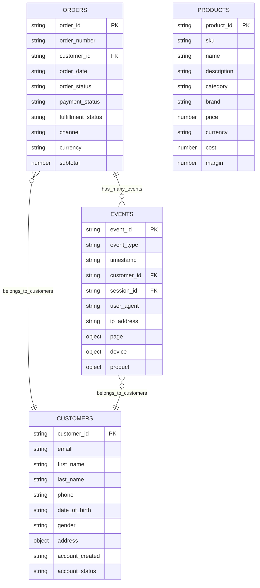

# Dataset Analysis Report: ecommerce

**Generated**: 2026-01-25 16:09:38

## Summary

- **Entities**: 4
- **Total Records**: 25
- **Relationships**: 3
- **XDM Recommendations**: 4

## ERD Diagram

## Discovered Entities

| Entity | Records | Fields | Primary Key | Foreign Keys |
| --- | --- | --- | --- | --- |
| customers | 5 | 16 | customer_id | customer_id |
| events | 10 | 14 | event_id | event_id, customer_id, session_id |
| orders | 5 | 30 | order_id | order_id, customer_id |
| products | 5 | 22 | product_id | product_id |

## Entity Relationships

| From | To | Type | Confidence | Description |
| --- | --- | --- | --- | --- |
| orders | customers | N:1 | 95% | orders.customer_id references customers.customer_id |
| events | customers | N:1 | 90% | events.customer_id references customers.customer_id |
| orders | events | 1:N | 85% | orders may be referenced in multiple events |

## XDM Schema Recommendations

| Entity | XDM Class | Confidence | Field Groups |
| --- | --- | --- | --- |
| customers | XDM Individual Profile | 98% | Demographic Details, Personal Contact Details, Loyalty Details |
| events | XDM ExperienceEvent | 95% | Web Interaction Details, Session Details |
| orders | XDM Commerce Details | 90% | Commerce Details, Order Details, Payment Information |
| products | Custom Product Class | 85% | Product Details, Inventory Details |

## Identity Strategies

| Entity | Primary Identity | Namespace | Additional Identities |
| --- | --- | --- | --- |
| customers | customer_id | CRM_ID | email |
| events | session_id | SESSION_ID | customer_id |
| orders | order_id | ORDER_ID | customer_id |
