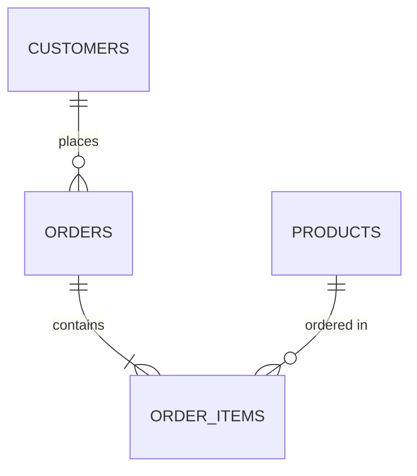

# AEP Integration Test CLI Workflow

Adobe Experience Platform 연동 테스트를 위한 전체 CLI 명령어 가이드입니다.

---

## 📋 목차

1. [초기 설정](#1-초기-설정)
2. [샘플 데이터 생성](#2-샘플-데이터-생성)
3. [ERD 다이어그램 생성](#3-erd-다이어그램-생성-선택)
4. [스키마 생성](#4-스키마-생성)
5. [데이터 검증 및 변환](#5-데이터-검증-및-변환)
6. [데이터 업로드](#6-데이터-업로드)
7. [스키마 및 데이터셋 관리](#7-스키마-및-데이터셋-관리)

---

## 1. 초기 설정

### 1.1 AEP 자격 증명 설정

```bash
# 대화형 설정 마법사 실행
aep init

# 또는 환경 변수로 설정
# .env 파일 생성 후 다음 내용 추가:
# AEP_CLIENT_ID=your_client_id
# AEP_CLIENT_SECRET=your_client_secret
# AEP_ORG_ID=your_org_id@AdobeOrg
# AEP_TECHNICAL_ACCOUNT_ID=your_tech_account_id@techacct.adobe.com
# AEP_TENANT_ID=your_tenant_id
# AEP_SANDBOX_NAME=prod
# ANTHROPIC_API_KEY=your_anthropic_key
```

### 1.2 인증 테스트

```bash
# AEP 연결 테스트
aep auth test

# 브라우저에서 AEP UI 열기
aep web open
```

---

## 2. 샘플 데이터 생성

### 2.1 AI 기반 도메인 설명으로 데이터 생성

```bash
# E-commerce 도메인 샘플 데이터 생성
aep generate from-domain \
  --domain "E-commerce platform with customers, products, orders, and web events" \
  --output test-data/ecommerce

# 생성되는 파일:
# - test-data/ecommerce/customers.json (고객 프로필)
# - test-data/ecommerce/products.json (상품 카탈로그)
# - test-data/ecommerce/orders.json (주문 트랜잭션)
# - test-data/ecommerce/events.json (웹 이벤트)
# - test-data/ecommerce/README.md (데이터 구조 설명)
```

### 2.2 다양한 도메인 예제

```bash
# 소셜 미디어 플랫폼
aep generate from-domain \
  --domain "Social media platform with user profiles, posts, comments, and likes" \
  --output test-data/social

# 금융 서비스
aep generate from-domain \
  --domain "Banking system with accounts, transactions, and customer interactions" \
  --output test-data/finance

# SaaS 애플리케이션
aep generate from-domain \
  --domain "SaaS product with user subscriptions, feature usage, and support tickets" \
  --output test-data/saas
```

---

## 3. ERD 다이어그램 생성 (선택)

### 3.1 AI 기반 ERD 생성

```bash
# 도메인 설명으로 ERD 생성
aep ai analyze-domain \
  --domain "E-commerce platform" \
  --output output/ai-analysis/ecommerce-erd.md

# 기존 데이터에서 ERD 추출
aep ai analyze --data test-data/ecommerce/customers.json \
  --erd-output output/ai-analysis/customer-erd.md
```

### 3.2 ERD 구조 예제

생성된 ERD (Mermaid 형식):


---

## 4. 스키마 생성

### 4.1 샘플 데이터로부터 스키마 생성

```bash
# JSON 파일에서 자동 스키마 생성
aep schema create \
  --from-sample test-data/ecommerce/customers.json \
  --name "Customer Profile Schema" \
  --class-id "https://ns.adobe.com/xdm/context/profile" \
  --description "E-commerce customer profile data" \
  --output schemas/customer_schema.json \
  --upload

# ExperienceEvent 스키마 생성
aep schema create \
  --from-sample test-data/ecommerce/events.json \
  --name "Web Event Schema" \
  --class-id "https://ns.adobe.com/xdm/context/experienceevent" \
  --upload
```

### 4.2 ERD로부터 스키마 생성 (권장)

```bash
# ERD에서 특정 엔티티 선택하여 스키마 생성

# 1. Customer Profile Schema
aep schema create \
  --from-erd output/ai-analysis/test.md \
  --entity CUSTOMERS \
  --name "Customer Profile Schema" \
  --upload

# 2. Product Catalog Schema (Profile class로 lookup data)
aep schema create \
  --from-erd output/ai-analysis/test.md \
  --entity PRODUCTS \
  --name "Product Catalog Schema" \
  --upload

# 3. Order Event Schema
aep schema create \
  --from-erd output/ai-analysis/test.md \
  --entity ORDERS \
  --name "Order Event Schema" \
  --upload

# 4. Web Event Schema
aep schema create \
  --from-erd output/ai-analysis/test.md \
  --entity EVENTS \
  --name "Web Event Schema" \
  --upload
```

### 4.3 XDM 클래스 자동 추론

CLI가 엔티티 이름으로부터 자동으로 XDM 클래스를 추론합니다:

| 엔티티 키워드 | XDM Class | 용도 |
|-------------|-----------|------|
| event, activity, transaction, order | ExperienceEvent | 시간 기반 이벤트 데이터 |
| product, item, catalog | Profile | 제품 카탈로그 (lookup data) |
| customer, user, account, profile | Profile | 고객/사용자 프로필 |

### 4.4 스키마 생성 옵션

```bash
# 드라이런 모드 (실제 업로드 없이 JSON만 생성)
aep schema create \
  --from-sample data.json \
  --name "Test Schema" \
  --output test_schema.json

# 특정 XDM 클래스 지정
aep schema create \
  --from-sample data.json \
  --name "Custom Schema" \
  --class-id "https://ns.adobe.com/xdm/context/experienceevent" \
  --upload

# 설명 추가
aep schema create \
  --from-erd erd.md \
  --entity ORDERS \
  --name "Order Transactions" \
  --description "Order transaction events from e-commerce platform" \
  --upload
```

---

## 5. 데이터 검증 및 변환

### 5.1 XDM 스키마 검증

```bash
# JSON 데이터를 스키마에 대해 검증
aep validate \
  --data test-data/ecommerce/customers.json \
  --schema schemas/customer_schema.json

# 여러 파일 일괄 검증
aep validate \
  --data test-data/ecommerce/*.json \
  --schema-dir schemas/
```

### 5.2 데이터 변환 (CSV → Parquet)

```bash
# CSV를 Parquet으로 변환 (AEP 업로드 최적화)
aep convert csv-to-parquet \
  --input data/customers.csv \
  --output data/customers.parquet

# JSON을 Parquet으로 변환
aep convert json-to-parquet \
  --input test-data/ecommerce/orders.json \
  --output data/orders.parquet
```

---

## 6. 데이터 업로드

### 6.1 데이터셋 생성 및 데이터 업로드

```bash
# 스키마로부터 데이터셋 생성
aep dataset create \
  --schema-id "https://ns.adobe.com/acssandboxgdctwo/schemas/customer_schema" \
  --name "Customer Profiles Dataset" \
  --description "Production customer profile data"

# 데이터 업로드 (Parquet 권장)
aep ingest upload \
  --dataset "Customer Profiles Dataset" \
  --file data/customers.parquet \
  --format parquet

# JSON 직접 업로드
aep ingest upload \
  --dataset "Order Events Dataset" \
  --file test-data/ecommerce/orders.json \
  --format json

# 대용량 파일 배치 업로드 (진행률 표시)
aep ingest upload \
  --dataset "Web Events Dataset" \
  --file large_events.parquet \
  --batch-size 10000 \
  --format parquet \
  --show-progress
```

### 6.2 일괄 업로드 (여러 파일)

```bash
# 디렉토리 내 모든 파일 업로드
aep ingest bulk-upload \
  --dataset "Order Events Dataset" \
  --directory test-data/ecommerce/ \
  --pattern "*.json"

# 여러 데이터셋에 맵핑하여 업로드
aep ingest bulk-upload \
  --config upload-config.json
```

**upload-config.json 예제:**
```json
{
  "uploads": [
    {
      "dataset": "Customer Profiles Dataset",
      "file": "test-data/ecommerce/customers.json",
      "format": "json"
    },
    {
      "dataset": "Product Catalog Dataset",
      "file": "test-data/ecommerce/products.json",
      "format": "json"
    },
    {
      "dataset": "Order Events Dataset",
      "file": "test-data/ecommerce/orders.json",
      "format": "json"
    }
  ]
}
```

---

## 7. 스키마 및 데이터셋 관리

### 7.1 스키마 조회

```bash
# 모든 스키마 목록
aep schema list

# 스키마 상세 정보
aep schema get "https://ns.adobe.com/acssandboxgdctwo/schemas/customer_schema"

# 스키마 ID로 조회
aep schema get customer_schema

# 스키마 JSON 다운로드
aep schema get customer_schema --output downloaded_schema.json
```

### 7.2 데이터셋 조회

```bash
# 모든 데이터셋 목록
aep dataset list

# 데이터셋 상세 정보
aep dataset get "Customer Profiles Dataset"

# 데이터셋 미리보기 (최근 데이터)
aep dataset preview "Customer Profiles Dataset" --limit 10
```

### 7.3 업로드 상태 확인

```bash
# 배치 업로드 상태 확인
aep ingest status --batch-id <batch-id>

# 최근 업로드 이력
aep ingest history --dataset "Order Events Dataset" --limit 10
```

---

## 🚀 완전한 E-commerce 테스트 워크플로우

전체 과정을 한 번에 실행하는 예제:

```bash
#!/bin/bash
# AEP E-commerce Integration Test

echo "=== Step 1: 인증 테스트 ==="
aep auth test

echo "=== Step 2: 샘플 데이터 생성 ==="
aep generate from-domain \
  --domain "E-commerce platform with customers, products, orders, and events" \
  --output test-data/ecommerce

echo "=== Step 3: ERD 분석 (AI) ==="
aep ai analyze-domain \
  --domain "E-commerce platform" \
  --output output/ai-analysis/ecommerce-erd.md

echo "=== Step 4: 스키마 생성 ==="
aep schema create --from-erd output/ai-analysis/ecommerce-erd.md \
  --entity CUSTOMERS --name "Customer Profile Schema" --upload

aep schema create --from-erd output/ai-analysis/ecommerce-erd.md \
  --entity PRODUCTS --name "Product Catalog Schema" --upload

aep schema create --from-erd output/ai-analysis/ecommerce-erd.md \
  --entity ORDERS --name "Order Event Schema" --upload

aep schema create --from-erd output/ai-analysis/ecommerce-erd.md \
  --entity EVENTS --name "Web Event Schema" --upload

echo "=== Step 5: 데이터셋 생성 ==="
aep dataset create \
  --schema-id "customer_schema" \
  --name "Customer Profiles Dataset"

aep dataset create \
  --schema-id "products_schema" \
  --name "Product Catalog Dataset"

aep dataset create \
  --schema-id "orders_schema" \
  --name "Order Events Dataset"

aep dataset create \
  --schema-id "events_schema" \
  --name "Web Events Dataset"

echo "=== Step 6: 데이터 변환 및 업로드 ==="
# JSON을 Parquet으로 변환 (성능 최적화)
for file in test-data/ecommerce/*.json; do
  basename=$(basename "$file" .json)
  aep convert json-to-parquet \
    --input "$file" \
    --output "data/${basename}.parquet"
done

# 데이터 업로드
aep ingest upload --dataset "Customer Profiles Dataset" \
  --file data/customers.parquet --format parquet

aep ingest upload --dataset "Product Catalog Dataset" \
  --file data/products.parquet --format parquet

aep ingest upload --dataset "Order Events Dataset" \
  --file data/orders.parquet --format parquet

aep ingest upload --dataset "Web Events Dataset" \
  --file data/events.parquet --format parquet

echo "=== Step 7: 검증 ==="
aep schema list
aep dataset list
aep ingest history --limit 5

echo "✅ AEP Integration Test Complete!"
```

---

## 💡 유용한 팁

### AI 기반 기능 활용

```bash
# 1. 자동 타입 추론 및 스키마 생성
aep schema create --from-sample data.json --name "Auto Schema" --upload

# 2. 데이터 품질 분석
aep ai analyze --data test-data/ecommerce/customers.json \
  --report quality_report.json

# 3. Identity 전략 추천
aep ai recommend-identity \
  --data test-data/ecommerce/customers.json
```

### 디버깅 및 문제 해결

```bash
# 상세 로그 출력
aep --verbose schema create --from-sample data.json --name "Debug Schema"

# 드라이런 모드로 테스트
aep schema create --from-sample data.json --name "Test" \
  --output test.json  # --upload 제거

# 에러 상세 정보
aep ingest upload --dataset "Test Dataset" --file data.json \
  --verbose --show-errors
```

### 환경별 설정

```bash
# 개발 환경
export AEP_SANDBOX_NAME=dev
aep auth test

# 스테이징 환경
export AEP_SANDBOX_NAME=staging
aep schema list

# 프로덕션 환경
export AEP_SANDBOX_NAME=prod
aep dataset list
```

---

## 📚 추가 리소스

- [AEP API Documentation](https://experienceleague.adobe.com/docs/experience-platform/landing/platform-apis/api-guide.html)
- [XDM Schema Guide](https://experienceleague.adobe.com/docs/experience-platform/xdm/home.html)
- [Data Ingestion Guide](https://experienceleague.adobe.com/docs/experience-platform/ingestion/home.html)

---

## 🎯 다음 단계

1. **Segment 생성**: AEP UI에서 업로드된 데이터로 세그먼트 생성
2. **Activation**: 세그먼트를 마케팅 플랫폼으로 활성화
3. **Real-time Profil**: 실시간 고객 프로필 확인
4. **Identity Graph**: ID 그래프 구성 확인

---

**생성 일자**: 2026-03-05  
**버전**: 1.0  
**테스트 환경**: Adobe Experience Platform Sandbox
