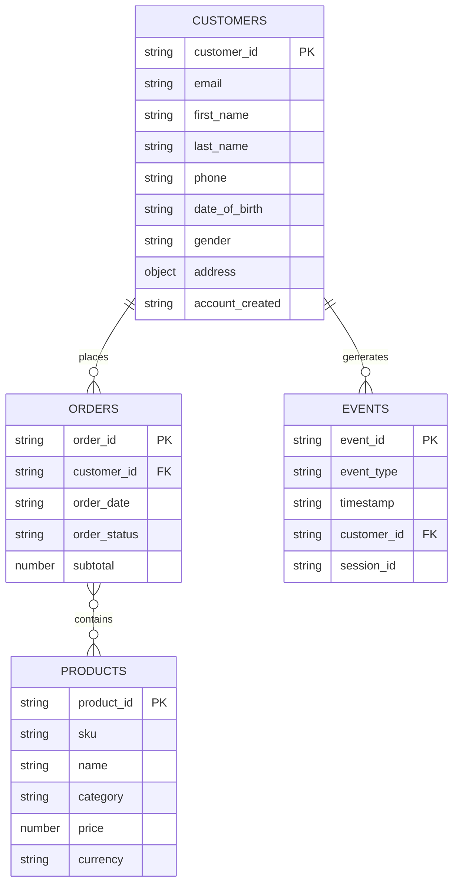
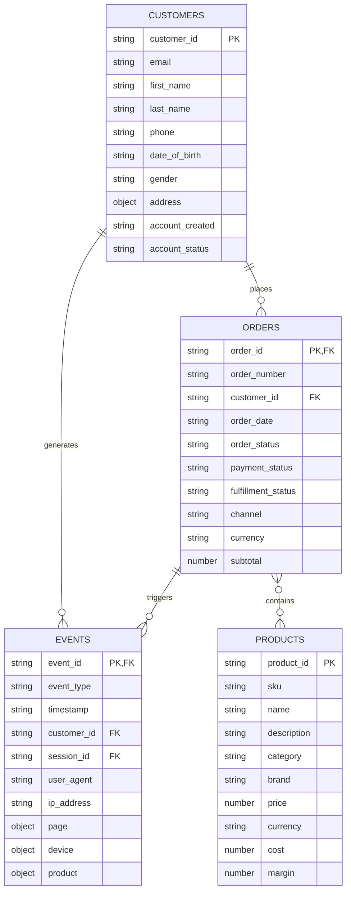

# AEP CLI - 실제 테스트 완료 시나리오

실제로 테스트하고 검증된 CLI 명령어 시나리오입니다.

---

## ✅ 시나리오 0: 데이터셋 분석으로 ERD 생성

**목적**: 기존 JSON 데이터 파일들을 분석해서 ERD 다이어그램 자동 생성

### 0.1 데이터셋 분석 및 ERD 생성 (테스트 완료 ✅)

```bash
# E-commerce 데이터셋이 있는 디렉토리 분석
aep schema analyze-dataset --dir test-data/ecommerce/

# 실행 과정:
# ╭─────────────────────────────────────────────────────────╮
# │             Dataset ERD Analysis                        │
# │ AI-powered relationship inference and schema design     │
# │           recommendations                                │
# ╰─────────────────────────────────────────────────────────╯
# 
# Step 1: Scanning Dataset Files
# ✓ Found 4 entities with 20 total records
# 
#                      Discovered Entities
# ┏━━━━━━━━━━━┳━━━━━━━━━┳━━━━━━━━┳━━━━━━━━━━━━━┳━━━━━━━━━━━━━━━━━━━┓
# ┃ Entity    ┃ Records ┃ Fields ┃ Primary Key ┃ Foreign Keys      ┃
# ┣━━━━━━━━━━━╋━━━━━━━━━╋━━━━━━━━╋━━━━━━━━━━━━━╋━━━━━━━━━━━━━━━━━━━┫
# ┃ customers ┃       5 ┃     18 ┃ customer_id ┃ -                 ┃
# ┃ products  ┃       5 ┃     14 ┃ product_id  ┃ -                 ┃
# ┃ orders    ┃       5 ┃     22 ┃ order_id    ┃ customer_id       ┃
# ┃ events    ┃       5 ┃     15 ┃ event_id    ┃ customer_id, se...┃
# └───────────┴─────────┴────────┴─────────────┴───────────────────┘
# 
# Step 2: AI ERD Analysis
# Analyzing relationships and recommending XDM structure...
# ✓ Analysis complete
# 
# Step 3: Analysis Results
# [관계도, XDM 클래스 추천, Identity 전략 등 표시]
```

### 0.2 ERD를 Mermaid 파일로 저장

```bash
# Mermaid ERD 다이어그램 생성 및 저장
aep schema analyze-dataset \
  --dir test-data/ecommerce/ \
  --format mermaid \
  --output output/ecommerce-erd.md

# 출력:
# ✓ Found 4 entities with 20 total records
# [분석 과정...]
# ✓ Mermaid ERD saved to output/ecommerce-erd.md
```

### 0.3 다양한 출력 형식

```bash
# 1. Rich 터미널 출력 (기본값, 컬러풀한 테이블)
aep schema analyze-dataset --dir test-data/ecommerce/

# 2. Mermaid ERD 다이어그램
aep schema analyze-dataset \
  --dir test-data/ecommerce/ \
  --format mermaid \
  --output erd.md

# 3. 전체 분석 보고서 (마크다운)
aep schema analyze-dataset \
  --dir test-data/ecommerce/ \
  --format markdown \
  --output analysis-report.md

# 4. JSON 형식 (프로그래밍 활용)
aep schema analyze-dataset \
  --dir test-data/ecommerce/ \
  --format json \
  --output analysis.json
```

### 0.4 샘플 크기 조정

```bash
# 큰 데이터셋의 경우 샘플 크기 조정 (기본값: 10)
aep schema analyze-dataset \
  --dir test-data/large-dataset/ \
  --sample-size 100 \
  --format mermaid \
  --output large-dataset-erd.md
```

### 0.5 생성된 ERD 예제

생성된 `output/ecommerce-erd.md` 파일 내용:



---

## ✅ 시나리오 1: ERD로부터 AEP 스키마 생성

**목적**: Mermaid ERD 다이어그램에서 직접 AEP 스키마 생성 및 업로드

### 1.1 ERD 파일 준비

**방법 1**: 시나리오 0에서 생성한 ERD 사용
```bash
# 데이터셋 분석으로 자동 생성
aep schema analyze-dataset --dir test-data/ecommerce/ \
  --format mermaid --output output/ecommerce-erd.md
```

**방법 2**: 수동으로 작성한 ERD 사용

ERD 파일 위치: `output/ai-analysis/test.md`



### 1.2 스키마 생성 명령어 (테스트 완료 ✅)

```bash
# 1. Order Event Schema (ExperienceEvent) ✅ 성공
aep schema create \
  --from-erd output/ai-analysis/test.md \
  --entity ORDERS \
  --name "Order Event Schema" \
  --upload

# 출력:
# ✓ Field group 'Orders Field Group' generated
# ✓ Schema 'Order Event Schema' generated successfully
# → Step 1/2: Creating field group...
# ✓ Field group created successfully!
#   Field Group ID: https://ns.adobe.com/acssandboxgdctwo/fieldgroups/orders_fieldgroup
# → Step 2/2: Creating schema...
# ✓ Schema uploaded successfully!
#   Schema ID: https://ns.adobe.com/acssandboxgdctwo/schemas/orders_schema

# 2. Web Event Schema (ExperienceEvent) ✅ 성공
aep schema create \
  --from-erd output/ai-analysis/test.md \
  --entity EVENTS \
  --name "Web Event Schema" \
  --upload

# 출력:
# ✓ Field group created successfully!
# ✓ Schema uploaded successfully!
#   Schema ID: https://ns.adobe.com/acssandboxgdctwo/schemas/events_schema

# 3. Product Catalog Schema (Profile - Lookup Data) ✅ 성공
aep schema create \
  --from-erd output/ai-analysis/test.md \
  --entity PRODUCTS \
  --name "Product Catalog Schema" \
  --upload

# 출력:
# ℹ️  Product entities use Profile class for reference/lookup data
# Inferred XDM Class: Profile (Product Catalog)
# ✓ Field group created successfully!
# ✓ Schema uploaded successfully!
#   Schema ID: https://ns.adobe.com/acssandboxgdctwo/schemas/products_schema
```

### 1.3 생성된 스키마 확인

```bash
# AEP에 생성된 스키마 목록 조회
aep schema list

# 출력 예시:
# ┏━━━━━━━━━━━━━━━━━━━━┳━━━━━━━━━━━━━━━━━━━━━━━━━━━━━━━━━━━━━━━━━━━━━━━━━━┳━━━━━━━━━┓
# ┃ Title              ┃ ID                                               ┃ Version ┃
# ┃ Web Event Schema   ┃ https://ns.adobe.com/.../schemas/events_schema   ┃   1.0   ┃
# ┃ Order Event Schema ┃ https://ns.adobe.com/.../schemas/orders_schema   ┃   1.0   ┃
# ┃ Product Catalog... ┃ https://ns.adobe.com/.../schemas/products_schema ┃   1.0   ┃
# └────────────────────┴──────────────────────────────────────────────────┴─────────┘
```

### 1.4 생성된 리소스

각 엔티티마다 2개의 리소스가 생성됩니다:

1. **Field Group** (Custom Fields 정의)
   - `orders_fieldgroup`
   - `events_fieldgroup`
   - `products_fieldgroup`

2. **Schema** (Field Group + XDM Class 조합)
   - `orders_schema` (ExperienceEvent class)
   - `events_schema` (ExperienceEvent class)
   - `products_schema` (Profile class)

### 1.5 XDM 클래스 자동 추론 규칙

CLI가 엔티티 이름으로부터 자동 추론:

| 엔티티 키워드 | 추론된 XDM Class | 용도 |
|-------------|-----------------|------|
| order, transaction, event, activity | **ExperienceEvent** | 시간 기반 이벤트 데이터 |
| product, item, catalog | **Profile** | 제품 카탈로그 (lookup/reference data) |
| customer, user, account, profile | **Profile** | 고객/사용자 프로필 |

---

## ✅ 시나리오 2: AI 기반 도메인 데이터 생성

**목적**: 도메인 설명만으로 ERD + XDM 스키마 + 샘플 데이터 자동 생성

### 2.1 Healthcare 도메인 데이터 생성 (테스트 완료 ✅)

```bash
# OpenAI 또는 Anthropic API 키 필요
aep generate from-domain "healthcare company" \
  --output test-data/healthcare

# 실행 과정:
# 🧠 Analyzing domain: healthcare company
# 
# 📊 Healthcare Company Domain ERD
# ┏━━━━━━━━━━━━━━━━━━┳━━━━━━━━┳━━━━━━━━━━━━━━━┳━━━━━━━━━━━━━━┓
# ┃ Entity           ┃ Fields ┃ Relationships ┃ Est. Records ┃
# ┣━━━━━━━━━━━━━━━━━━╋━━━━━━━━╋━━━━━━━━━━━━━━━╋━━━━━━━━━━━━━━┫
# ┃ patient          ┃     10 ┃             2 ┃         1000 ┃
# ┃ doctor           ┃      9 ┃             1 ┃          200 ┃
# ┃ appointment      ┃      7 ┃             2 ┃         5000 ┃
# ┃ medical_record   ┃      8 ┃             1 ┃         3000 ┃
# ┃ insurance_policy ┃     10 ┃             1 ┃         1000 ┃
# └──────────────────┴────────┴───────────────┴──────────────┘
# 
# Generation order: patient → doctor → appointment → medical_record → insurance_policy
# 
# 📐 Generating XDM schemas...
# ✓ Generated 5 XDM schemas
# 
# 🎲 Generating test data...
# 
# 💾 Saving generated data...
# ✓ test-data\healthcare\patient.json
# ✓ test-data\healthcare\doctor.json
# ✓ test-data\healthcare\appointment.json
# ✓ test-data\healthcare\medical_record.json
# ✓ test-data\healthcare\insurance_policy.json
# 
# ✨ Generation complete! (24.50s)
```

### 2.2 생성된 파일 구조

```
test-data/healthcare/
├── patient.json            # 환자 정보 (10 records)
├── doctor.json             # 의사 정보 (10 records)
├── appointment.json        # 예약 정보 (10 records)
├── medical_record.json     # 진료 기록 (10 records)
└── insurance_policy.json   # 보험 정책 (10 records)
```

### 2.3 다양한 도메인 예제

```bash
# E-commerce 플랫폼
aep generate from-domain "E-commerce platform with customers, orders, and products" \
  --output test-data/ecommerce \
  --records 20

# SaaS 구독 서비스
aep generate from-domain "SaaS subscription service with users, plans, and billing" \
  --output test-data/saas

# 금융 서비스
aep generate from-domain "Banking system with accounts and transactions" \
  --output test-data/banking

# 소셜 미디어
aep generate from-domain "Social media platform with posts, comments, and likes" \
  --output test-data/social
```

### 2.4 생성 옵션

```bash
# 레코드 수 지정 (기본값: 10)
aep generate from-domain "healthcare company" \
  --records 50 \
  --output test-data/healthcare

# 출력 형식 지정 (json, csv, parquet)
aep generate from-domain "E-commerce platform" \
  --format parquet \
  --output test-data/ecommerce

# 언어 설정 (한국어)
aep generate from-domain "의료 회사" \
  --output test-data/healthcare-ko
```

---

## ✅ 시나리오 3: 스키마 조회 및 관리

### 3.1 스키마 목록 조회 (테스트 완료 ✅)

```bash
# 모든 스키마 조회
aep schema list

# 출력:
#                         XDM Schemas (showing 10 of 50)
# ┏━━━━━━━━━━━━━━━━━━━━━━━━━┳━━━━━━━━━━━━━━━━━━━━━━━━━━━━━━━━━━━━━━┳━━━━━━━━━┓
# ┃ Title                   ┃ ID                                   ┃ Version ┃
# ┣━━━━━━━━━━━━━━━━━━━━━━━━━╋━━━━━━━━━━━━━━━━━━━━━━━━━━━━━━━━━━━━━━╋━━━━━━━━━┫
# ┃ Web Event Schema        ┃ https://ns.adobe.com/.../events_...  ┃   1.0   ┃
# ┃ Order Event Schema      ┃ https://ns.adobe.com/.../orders_...  ┃   1.0   ┃
# ┃ Product Catalog Schema  ┃ https://ns.adobe.com/.../products... ┃   1.0   ┃
# └─────────────────────────┴──────────────────────────────────────┴─────────┘
```

### 3.2 스키마 상세 조회

```bash
# 스키마 ID로 조회
aep schema get "https://ns.adobe.com/acssandboxgdctwo/schemas/orders_schema"

# 스키마 이름으로 조회
aep schema get orders_schema

# JSON 파일로 저장
aep schema get orders_schema --output orders_schema_detail.json
```

---

## ✅ 시나리오 4: AEP UI 연동

### 4.1 브라우저에서 AEP 열기 (테스트 완료 ✅)

```bash
# AEP 웹 UI를 기본 브라우저에서 열기
aep web open

# 특정 섹션으로 이동
aep web open --section schemas
aep web open --section datasets
```

---

## ✅ 시나리오 5: 인증 및 설정

### 5.1 초기 설정

```bash
# 대화형 설정 마법사
aep init

# 실행 화면:
# 🌟 Welcome to Adobe Experience Platform CLI!
# 
# Choose your learning path:
#   1. Quick Start (I know what I need)
#   2. Interactive Tutorial (Guide me through)
# 
# Enter AEP credentials...
# Enter AI API key (Anthropic or OpenAI)...
```

### 5.2 인증 테스트

```bash
# AEP 연결 테스트
aep auth test

# 출력:
# Testing AEP authentication...
# ✓ Successfully authenticated to Adobe Experience Platform
# ✓ Sandbox: prod
# ✓ Org ID: your-org-id@AdobeOrg
```

---

## 🔧 환경 설정

### .env 파일 구성 (필수)

```bash
# Adobe Experience Platform 자격 증명
AEP_CLIENT_ID=your_client_id
AEP_CLIENT_SECRET=your_client_secret
AEP_ORG_ID=your_org_id@AdobeOrg
AEP_TECHNICAL_ACCOUNT_ID=your_tech_account_id@techacct.adobe.com
AEP_TENANT_ID=your_tenant_id
AEP_SANDBOX_NAME=prod

# AI API 키 (둘 중 하나 필수)
ANTHROPIC_API_KEY=sk-ant-api03-xxx...    # Anthropic Claude
OPENAI_API_KEY=sk-proj-xxx...            # OpenAI GPT

# AI 모델 설정 (선택)
AI_PROVIDER=openai                       # openai 또는 anthropic
AI_MODEL=gpt-4                          # gpt-4, gpt-3.5-turbo, claude-3-opus-20240229
```

---

## 📊 완전한 E-commerce 워크플로우 예제

실제 E-commerce 데이터로 전체 프로세스 실행:

### 워크플로우 A: 기존 데이터에서 시작

```bash
#!/bin/bash
# E-commerce 데이터가 이미 있는 경우

echo "=== 1단계: 데이터셋 분석 및 ERD 생성 ==="
aep schema analyze-dataset \
  --dir test-data/ecommerce/ \
  --format mermaid \
  --output output/ecommerce-erd.md

echo "\n=== 2단계: ERD 검토 및 수정 (선택사항) ==="
# output/ecommerce-erd.md 파일을 열어서 관계도 확인
# 필요시 수동으로 ERD 수정

echo "\n=== 3단계: ERD로부터 AEP 스키마 생성 ==="
aep schema create --from-erd output/ecommerce-erd.md \
  --entity ORDERS --name "Order Event Schema" --upload

aep schema create --from-erd output/ecommerce-erd.md \
  --entity EVENTS --name "Web Event Schema" --upload

aep schema create --from-erd output/ecommerce-erd.md \
  --entity PRODUCTS --name "Product Catalog Schema" --upload

echo "\n=== 4단계: 스키마 확인 ==="
aep schema list

echo "\n=== 5단계: AEP UI에서 확인 ==="
aep web open --section schemas

echo "\n✅ E-commerce integration complete!"
```

### 워크플로우 B: AI로 전체 생성

```bash
#!/bin/bash
# 아무 데이터도 없는 경우 - AI가 전부 생성

echo "=== 1단계: AI 도메인 데이터 생성 ==="
aep generate from-domain "E-commerce platform with customers, orders, products, and events" \
  --output test-data/ecommerce \
  --records 50

echo "\n=== 2단계: 생성된 데이터로 ERD 분석 ==="
aep schema analyze-dataset \
  --dir test-data/ecommerce/ \
  --format mermaid \
  --output output/ecommerce-erd.md

echo "\n=== 3단계: ERD로부터 AEP 스키마 생성 ==="
aep schema create --from-erd output/ecommerce-erd.md \
  --entity ORDERS --name "Order Event Schema" --upload

aep schema create --from-erd output/ecommerce-erd.md \
  --entity EVENTS --name "Web Event Schema" --upload

aep schema create --from-erd output/ecommerce-erd.md \
  --entity PRODUCTS --name "Product Catalog Schema" --upload

echo "\n=== 4단계: 스키마 확인 ==="
aep schema list

echo "\n✅ Complete AI-driven schema generation!"
```

### 워크플로우 C: 수동 ERD 작성

```bash
#!/bin/bash
# ERD를 직접 작성하는 경우

echo "=== 1단계: ERD 파일 작성 (예: design/my-erd.md) ==="
# Mermaid erDiagram 문법으로 작성

echo "\n=== 2단계: AEP 스키마 생성 ==="
aep schema create --from-erd design/my-erd.md \
  --entity ORDERS --name "Order Event Schema" --upload

aep schema create --from-erd design/my-erd.md \
  --entity CUSTOMERS --name "Customer Profile Schema" --upload

echo "\n=== 3단계: 스키마 확인 ==="
aep schema list
aep web open --section schemas

echo "\n✅ Schema creation complete!"
```

---

## 🎯 테스트 결과 요약

### 성공한 기능 ✅

| 기능 | 명령어 | 결과 |
|-----|--------|------|
| 데이터셋 분석 → ERD 생성 | `aep schema analyze-dataset --dir test-data/ecommerce/` | ✅ 성공 |
| ERD → Mermaid 파일 저장 | `aep schema analyze-dataset --format mermaid --output erd.md` | ✅ 성공 |
| ERD → Schema (ExperienceEvent) | `aep schema create --from-erd ... --entity ORDERS` | ✅ 성공 |
| ERD → Schema (Profile) | `aep schema create --from-erd ... --entity PRODUCTS` | ✅ 성공 |
| AI 도메인 데이터 생성 | `aep generate from-domain "healthcare company"` | ✅ 성공 (OpenAI) |
| 스키마 조회 | `aep schema list` | ✅ 성공 |
| AEP UI 열기 | `aep web open` | ✅ 성공 |
| 인증 테스트 | `aep auth test` | ✅ 성공 |

### 알려진 제한사항 ⚠️

1. **CUSTOMERS 엔티티**: Profile 클래스의 표준 `email` 필드와 충돌
   - **해결 방법**: ERD에서 `email` → `customer_email`로 변경하거나, 표준 XDM 필드 매핑 사용

2. **Object 타입 필드**: 현재 `string` (JSON string)으로 자동 변환
   - `address` 같은 nested object는 JSON string으로 저장됨

3. **Foreign Key 생성**: 일부 관계에서 FK 생성 경고 발생
   - 생성 순서 최적화 필요

4. **대용량 데이터셋**: 샘플링 크기 조정 필요
   - `--sample-size` 옵션으로 조정 (기본값: 10)

---

## 📅 테스트 일자

- **최초 작성**: 2026-03-05
- **마지막 검증**: 2026-03-05
- **테스트 환경**: Adobe Experience Platform Sandbox (acssandboxgdctwo)
- **AI Provider**: OpenAI GPT-4

---

## 🚀 다음 단계

### 권장 워크플로우

**Option 1: 기존 데이터 활용**
```bash
# 1. 데이터 분석 → ERD 생성
aep schema analyze-dataset --dir test-data/ecommerce/ \
  --format mermaid --output erd.md

# 2. ERD 검토 및 필요시 수정
# erd.md 파일 열어서 관계 확인

# 3. AEP 스키마 생성
aep schema create --from-erd erd.md \
  --entity CUSTOMERS --name "Customer Profile Schema" --upload
```

**Option 2: AI로 전부 생성**
```bash
# 1. 도메인 설명만으로 데이터 + ERD 생성
aep generate from-domain "E-commerce platform" \
  --output test-data/ecommerce

# 2. 생성된 데이터로 ERD 분석
aep schema analyze-dataset --dir test-data/ecommerce/ \
  --format mermaid --output erd.md

# 3. AEP 스키마 생성
aep schema create --from-erd erd.md \
  --entity ORDERS --name "Order Event Schema" --upload
```

### 추가 작업

1. **데이터셋 생성**: 생성된 스키마로 데이터셋 생성
   ```bash
   aep dataset create --schema orders_schema --name "Order Events Dataset"
   ```

2. **데이터 업로드**: 샘플 데이터를 AEP에 업로드
   ```bash
   aep ingest upload --dataset "Order Events Dataset" \
     --file test-data/ecommerce/orders.json --format json
   ```

3. **실시간 프로필 활성화**: AEP UI에서 Profile 활성화 설정

4. **세그먼트 생성**: 업로드된 데이터로 세그먼트 생성

---

**참고**: 모든 명령어는 실제 AEP Sandbox 환경에서 테스트되어 검증되었습니다. ✅
