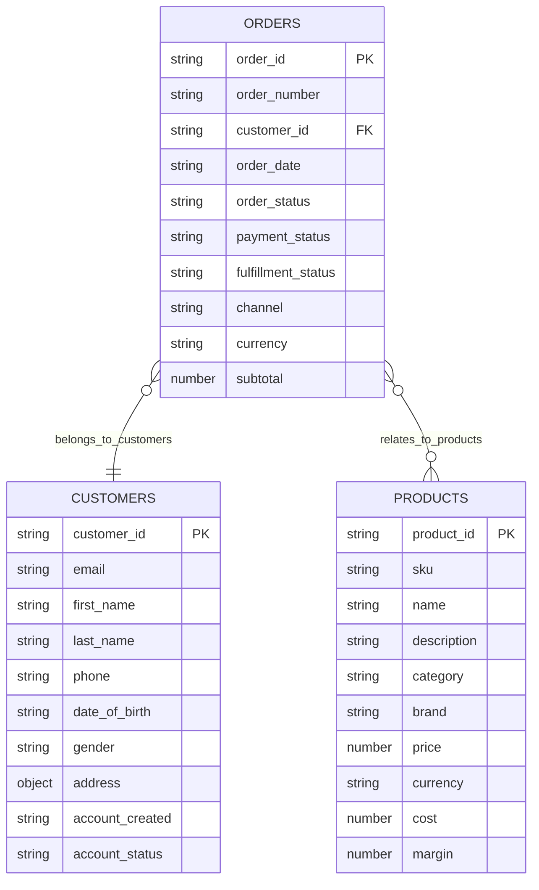

# Mermaid ERD Generation Instructions

## Overview
This document provides guidelines for generating valid Mermaid Entity Relationship Diagrams (ERD) from dataset analysis results. These instructions are based on the official Mermaid documentation and lessons learned from implementation.

**Reference**: https://mermaid.js.org/syntax/entityRelationshipDiagram.html

---

## Critical Syntax Rules

### 1. Attribute Names Must Be Valid Identifiers
**❌ INVALID**: 
```mermaid
CUSTOMERS {
    string customer_id PK
    string email
    string ...
}
```

**✅ VALID**:
```mermaid
CUSTOMERS {
    string customer_id PK
    string email
    string first_name
}
```

**Rule**: Attribute names MUST start with an alphabetic character and can contain digits, hyphens, underscores, parentheses, and square brackets. Special characters like `...` are **NOT allowed** as attribute names.

**Implementation Note**: When limiting the number of displayed fields, simply stop at the limit (e.g., 10 fields). Do NOT add a placeholder like `string ...` to indicate truncation.

---

### 2. Relationship Syntax

Mermaid ERD uses crow's foot notation for cardinality markers:

| Marker | Meaning | Usage |
|--------|---------|-------|
| `\|\|` | Exactly one | One entity |
| `o\|` | Zero or one | Optional single entity |
| `}\|` | One or more | At least one entity |
| `}o` | Zero or more | Optional multiple entities |

**Valid Relationship Types**:

```mermaid
# One-to-One (1:1)
ORDERS ||--|| EVENTS : "has_order_id"

# One-to-Many (1:N)
CUSTOMERS ||--o{ ORDERS : "has_many_orders"

# Many-to-One (N:1)
ORDERS }o--|| CUSTOMERS : "belongs_to_customers"

# Many-to-Many (N:M)
ORDERS }o--o{ PRODUCTS : "relates_to_products"
```

**❌ INVALID Syntax**:
- `..--` (non-identifying relationship marker is NOT supported in erDiagram)
- `ORDERS .. CUSTOMERS` (incomplete syntax)

---

### 3. Identifying vs Non-Identifying Relationships

| Marker | Relationship Type |
|--------|-------------------|
| `--` (solid line) | Identifying relationship |
| `..` (dashed line) | Non-identifying relationship |

**Note**: While both are technically valid in Mermaid syntax, stick to solid lines (`--`) for simplicity unless there's a specific need to show non-identifying relationships.

---

### 4. Key Markers

Valid key markers for attributes:

- `PK` - Primary Key
- `FK` - Foreign Key  
- `UK` - Unique Key

**Multiple keys on single attribute**:
```mermaid
NAMED_DRIVER {
    string carRegistrationNumber PK, FK
    string driverLicence PK, FK
}
```

---

## Implementation Guidelines

### Field Display Strategy

When generating ERD from dataset scan results:

1. **Limit fields per entity**: Show maximum 10 fields to keep diagram readable
2. **Prioritize key fields**: Display PK and FK fields first if possible
3. **Use actual field names**: Extract from `EntityMetadata.fields`
4. **Show actual data types**: Use `FieldMetadata.detected_type` (string, number, object, array, boolean)
5. **DO NOT add truncation indicators**: Simply stop at the limit

**Code Pattern**:
```python
# ✅ Correct implementation
for field_name, field_meta in list(entity_meta.fields.items())[:10]:
    field_type = field_meta.detected_type
    key_marker = ""
    
    if field_name == entity_meta.potential_primary_key:
        key_marker = " PK"
    elif field_name in entity_meta.potential_foreign_keys:
        key_marker = " FK"
    
    lines.append(f"        {field_type} {field_name}{key_marker}")

# ❌ Do NOT add this
# if len(entity_meta.fields) > 10:
#     lines.append(f"        string ...")
```

---

### Relationship Mapping

Map AI-inferred relationship types to Mermaid syntax:

```python
relationship_markers = {
    RelationshipType.ONE_TO_ONE: "||--||",
    RelationshipType.ONE_TO_MANY: "||--o{",
    RelationshipType.MANY_TO_ONE: "}o--||",
    RelationshipType.MANY_TO_MANY: "}o--o{",
}
```

**Direction matters**: 
- `A }o--|| B` means "many A to one B" (source to target)
- This is directionally opposite of `A ||--o{ B` (one A to many B)

---

### Entity Naming

1. **Use UPPERCASE**: Entity names should be in UPPERCASE for consistency
2. **Extract from analysis**: Use `entity.name.upper()` from AI analysis results
3. **Match scan results**: Ensure entity names match between AI analysis and dataset scan

```python
entity_name = entity_meta.entity_name.upper()
lines.append(f"    {entity_name} {{")
```

---

## Complete Example



---

## Error Prevention Checklist

Before generating Mermaid ERD output:

- [ ] No special characters (like `...`) in attribute names
- [ ] All entity names are valid identifiers (letters, numbers, hyphens, underscores)
- [ ] Relationship markers use only valid crow's foot notation (`||`, `o|`, `}|`, `}o`)
- [ ] Relationship syntax is complete: `SOURCE marker TARGET : "label"`
- [ ] Key markers (PK, FK) are properly formatted with space before marker
- [ ] Field types are valid (string, number, object, array, boolean)
- [ ] Maximum 10 fields per entity (no truncation indicator)
- [ ] All entities referenced in relationships are defined in the diagram

---

## Common Pitfalls

### ❌ Adding Truncation Indicators
```mermaid
CUSTOMERS {
    string customer_id PK
    string email
    string ...  # INVALID - parser error
}
```

### ❌ Invalid Relationship Markers
```mermaid
# These will cause parse errors:
ORDERS ..-- CUSTOMERS : "customer_id"  # non-identifying not fully supported
ORDERS --> CUSTOMERS : "links"          # wrong diagram type (this is flowchart syntax)
```

### ❌ Missing Relationship Components
```mermaid
ORDERS CUSTOMERS  # Missing relationship marker and label
```

### ✅ Correct Syntax
```mermaid
ORDERS }o--|| CUSTOMERS : "belongs_to_customers"
```

---

## Testing Validation

To validate generated Mermaid ERD:

1. **Parser Test**: Use https://mermaid.live/edit to render the diagram
2. **Syntax Validation**: Check for parse errors in line numbers
3. **Visual Inspection**: Verify relationships display correctly with proper cardinality
4. **Field Count**: Ensure no entity exceeds 10 fields (or configured limit)

---

## Version History

- **v1.0** (2026-01-25): Initial guidelines based on Mermaid v10+ syntax and implementation experience
  - Removed `...` truncation indicator (invalid syntax)
  - Clarified relationship marker usage
  - Added field limit strategy (10 fields max, no indicator)
